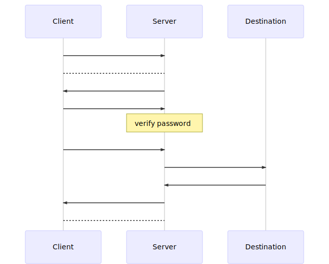

[](https://travis-ci.com/Immueggpain/smartproxy)

## Introduction 

**A naive implementation of tcp tunnel.**

- smartproxy sends random data of random length at the beginning of each connection (but I see no effect in doing this)
- is anti-dropout.
- follows 0-RTT pattern.
- can redirect traffic on user rules, whether direct connect or through a smartproxy server.
- accepts HTTP, SOCKS4, SOCKS4a, SOCKS5 requests. **But SOCKS5 is recommended.**
- also redispatches HTTP requests, so some old HTTP clients without keep-alive support will enjoy some performance boost.



[//]: # ()

## QuickStart
* Make sure you have **[Java](https://jdk.java.net/11/) 8+** installed. You also need a **valid** SSL cert on server.
* [Download latest build](https://github.com/Immueggpain/smartproxy/releases). Unzip it
* Run `java -jar smartproxy-x.x.x.jar --help` to get help.
* Run client `java -jar smartproxy-x.x.x.jar -m client -n <local_listening_port> -p <server_listening_port> -s <server_ip> -w <secret_password>`.
* Run server `java -jar smartproxy-x.x.x.jar -m server -c <cert_file> -k <private_key_file> -p <server_listening_port> -w <secret_password>`.
* start Chrome with --proxy-server="socks5://127.0.0.1:<local_listening_port>"
* Enjoy!

## How to get SSL cert
see [certbot](https://certbot.eff.org/)

## user.rule
You may also update your user.rule file for better experience. Just download it and replace the old one.  
[The lastest user.rule can be downloaded here.](user.rule)  
**smartproxy** automatically uses user.rule file in current working directory as routing configuration.  
```
# A line which starts with "#" is comment
# "a.com" means "a.com" only, ".a.com" means "a.com" and all sub domains of "a.com" 
# we can also use ip range like "192.168.0.0 192.168.255.255"
#
# "direct" means connect without proxy
# "proxy" means forward to backend proxy
# "reject" means drop connection
```
For example, when deciding routes of **sub.domain.com**, smartproxy first checks if there's a **sub.domain.com** rule.  
Then it checks **.sub.domain.com**. Then **.domain.com**. Then **.com**.  
And lastly, if all miss, it uses default rule, which is **proxy**.

## Build
You need [**Maven**](https://maven.apache.org/) to build **smartproxy**.  
Just run `maven install` and you will find the jar and zip generated in the `target` folder.  
You can also import the project using [**Eclipse**](https://www.eclipse.org/).

## etc
[Old README for v0.5.0](README-0.5.0.md) 
